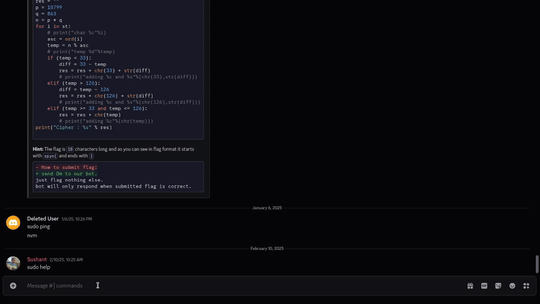

# Gnome Nepal Discord Guide
Discord is a platform for communication and community building, and Gnome Nepal is excited to welcome you to our server! This guide will help you navigate our community, understand our rules, and get started on your journey with us.
<!-- truncate -->


Welcome to **Gnome Nepal** on Discord! This guide will walk you through our vibrant community, a hub for collaboration, creativity, and meaningful conversations. Whether you're a GNOME enthusiast, developer, or contributor, you're in the right place to connect, learn, and innovate.

---

## 🌐 About Gnome Nepal
Gnome Nepal is a welcoming space for anyone passionate about the GNOME ecosystem. Here, we share knowledge, spark ideas, and build together.

## 📜 Community Rules

We’re all about respect and positivity. Here’s how to keep our community awesome:

<details>
  <summary>Code of Conduct</summary>

  <details>
    <summary>Be Kind & Respectful</summary>
    Treat everyone with courtesy. Respect mods and admins—they’re here to keep things smooth and safe.
  </details>

  <details>
    <summary>Keep It Safe</summary>
    No harmful or offensive content. We want everyone to feel comfortable and included.
  </details>

  <details>
    <summary>Stay On Topic</summary>
    Post in the right channels and skip repetitive or off-topic messages.
  </details>

  <details>
    <summary>No NSFW Content</summary>
    Keep it appropriate for all ages—no exceptions.
  </details>

  <details>
    <summary>Use English or Nepali</summary>
    Stick to these languages so everyone can join the conversation.
  </details>

  <details>
    <summary>Don’t Spam</summary>
    Avoid flooding chats with messages, emojis, or links.
  </details>

  <details>
    <summary>Voice Channel Etiquette</summary>
    No mic spam or random noise—keep it clear for everyone.
  </details>

  <details>
    <summary>Respect Privacy</summary>
    Don’t record voice chats without permission.
  </details>

  <details>
    <summary>Use Channels Right</summary>
    Post where it fits to keep things organized.
  </details>

  <details>
    <summary>Be Yourself</summary>
    Use your real name (or a polite alias) to build trust.
  </details>
</details>

---

## 🚀 How to Join

Ready to dive in? Here’s how to join the Gnome Nepal Discord:

<details>
  <summary>Joining the Server</summary>

  <details>
    <summary>With the Discord App</summary>
    1. [Download Discord](https://discord.com/download) if you don’t have it.
    2. Sign up or log in.
    3. Click this link: [Join Gnome Nepal](https://discord.com/invite/tpsVFJN8WC).
    4. Accept the invite—you’re in!
    5. Check out the rules to get started.
  </details>

  <details>
    <summary>Through a Browser</summary>
    1. Visit [Discord’s site](https://discord.com).
    2. Log in or create an account.
    3. Use this link: [Join Gnome Nepal](https://discord.com/invite/tpsVFJN8WC).
    4. Accept the invite and join us.
    5. (Optional) Download the app for the best experience.
    6. Read the guidelines to get comfy.
  </details>
</details>

<details> 
    <summary>Getting Started</summary>

  Welcome aboard! Explore the channels and say hi in **[#introduce](https://discord.com/channels/1233242660966236220/1291070896236269568)**. Try this casual intro template:

  ```markdown
  - **Name:** [Your Name]
  - **Education:** [Your School]
  - **Interests:** [What you love or why you’re here]
  - **Fun Fact:** [Something cool about you]
  - **GitHub (optional):** [Your profile link]
  ```

  Add whatever feels right—we’re excited to meet you!
</details>

---

## 🎥 Watch Our Video Guide

Check out this video for a quick rundown of what’s next in our community:
<iframe width="560" height="315" src="https://www.youtube.com/embed/-Acd3IuRAQY?rel=0&vq=hd1080" frameborder="2" allowfullscreen></iframe>

---

## ❓ FAQ

<details>
  <summary>How do I change my username?</summary>
  1. Go to [#Commands](https://discord.com/channels/1233242660966236220/1298337866270642226).
  2. Type `/nick`, click “New Nick,” and enter your name (real names preferred!).
  
</details>

<details>
  <summary>How do I pick roles & Channels?</summary>
<details>
  <summary>For Roles</summary>
  1. Head to [Roles](https://discord.com/channels/1233242660966236220/customize-community) and pick roles that match your vibe.
  2. Check out the interesting roles you need to get started.
</details>
<details>
  <summary>For Channels</summary>
  1. Head to [Channels](https://discord.com/channels/1233242660966236220/browse) and pick channels that match your vibe.
  2. Check out the interesting channels you need to get started.
</details>
</details>

---

## 🎨 Credits

- **Written & Video by:** Prarambha Bashyal
- **Video Edited by:** Narayan Bhusal