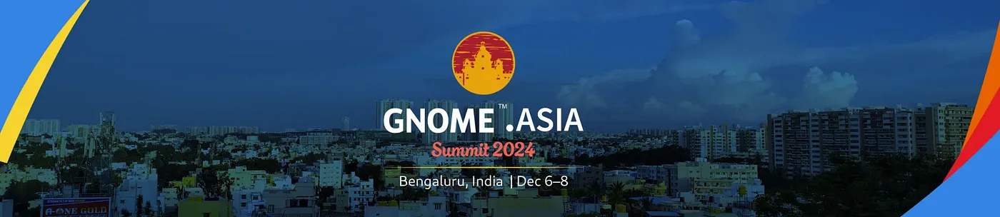
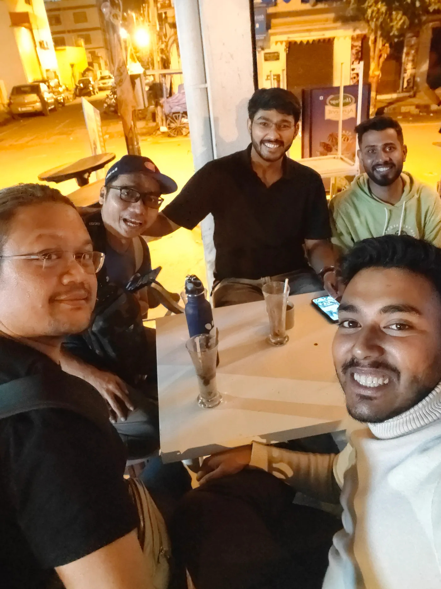
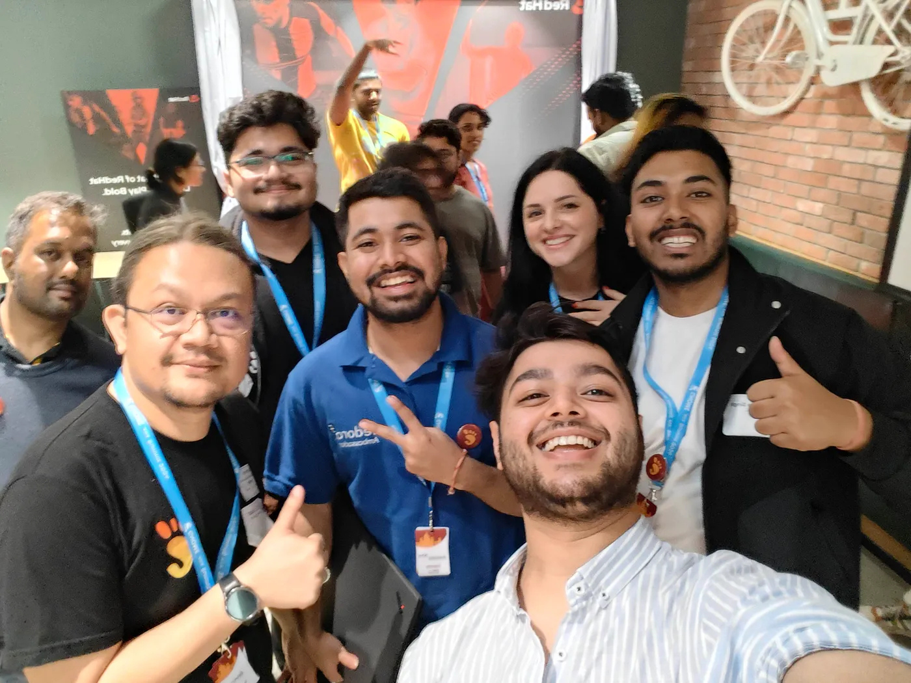
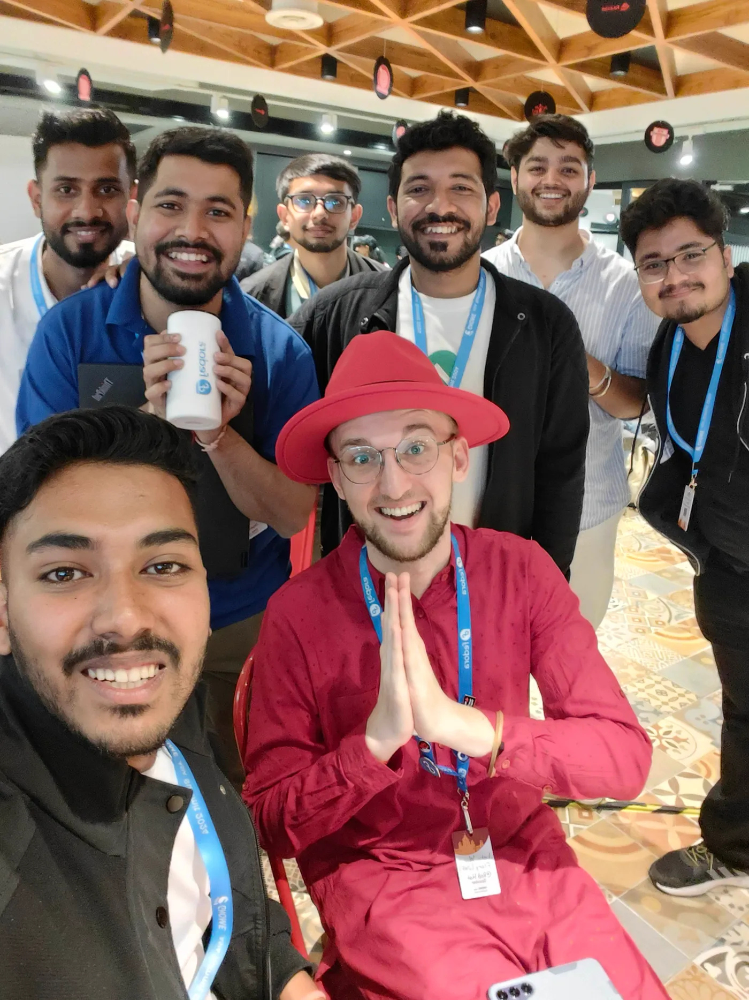
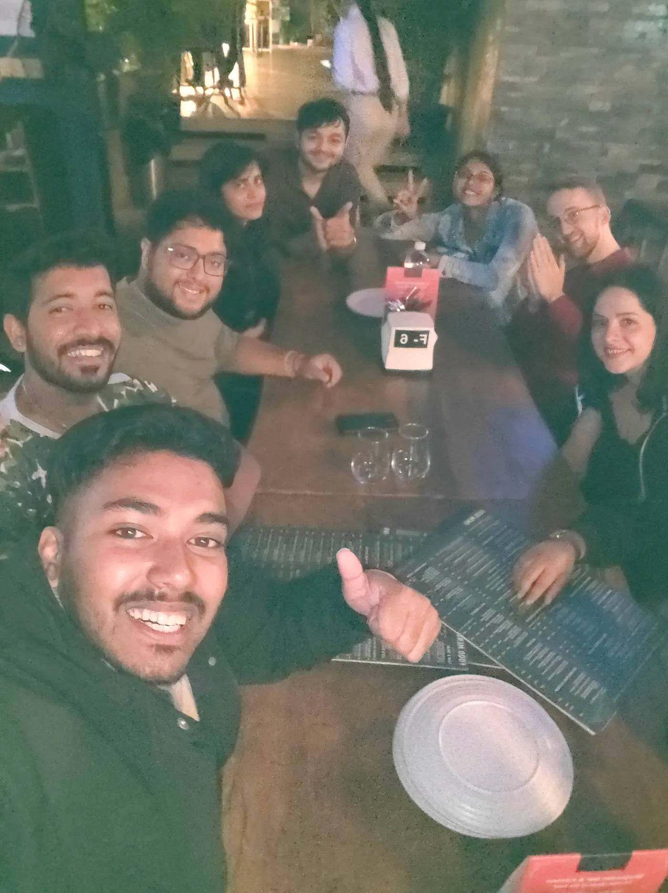
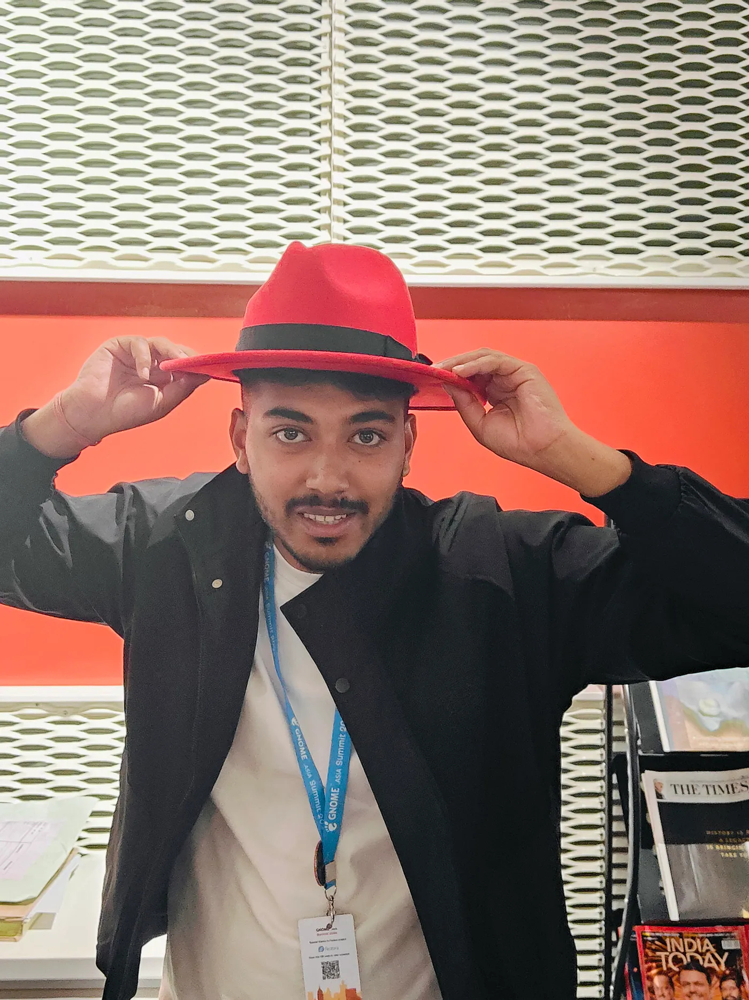
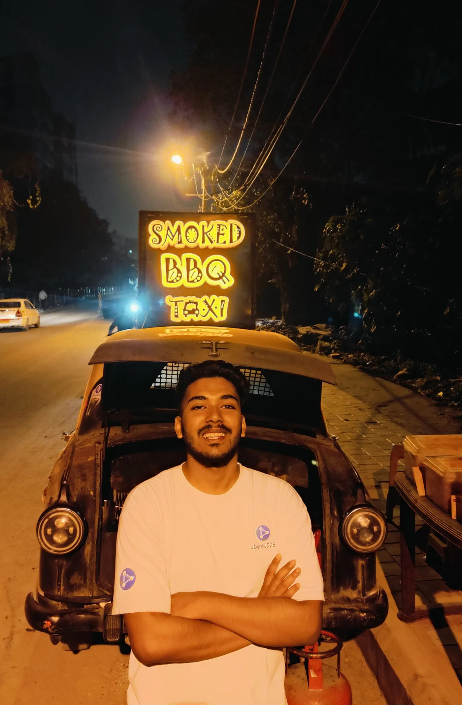
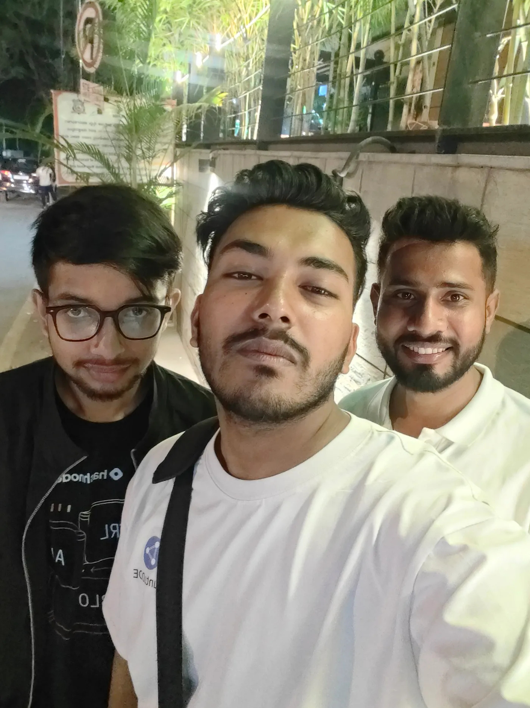

GNOME Asia Summit 2024 in Bengaluru marked a significant milestone in my journey as a GNOME contributor. Having previously experienced the excitement of the GNOME Asia Summit in Nepal as a local organizer, this time, I had the incredible honor of attending as a speaker.
<!-- truncate -->
As an active GNOME contributor and community lead at GNOME Nepal, I am passionate about community building. My talk, titled “*Build a GNOME Community? Yes, You Can*” focused on inspiring and motivating the audience in Bengaluru to launch initiatives of their own. I shared insights on common challenges, actionable solutions, and the steps that can make the process of building communities easier.

### Arrival In Bengaluru

I left Nepal on December 5th to attend the summit on December 6th. The GNOME Foundation graciously sponsored my flight and accommodation. After landing at Kempegowda International Airport, I met Sailesh Singh, my fellow speaker and a dedicated GNOME Nepal community member, who was traveling from Bagdogra Airport. Finding the right terminal to meet up was a small adventure in itself. Once reunited, we headed to our hotel near Bagmane Tech Park, close to the venue.

### Meetup With Ubuntu Friends

That evening, Fenris, Jipang, and Aryan invited me for a quick catch-up. We hadn’t met since UbuCon Asia in Jaipur, so it was a wonderful reunion. Sailesh and I spent the night with Ubuntu friends sharing laughs, updates, and excitement for the conference the next day.

### Day 1 : Conference Begins

On December 6th, we headed to the venue, the Red Hat office. I was thrilled to meet my Fedora friends — Akaashdeep, Samyak, Sumantro, Sudhir, and Justin — whom I hadn’t seen since the last GNOME Asia Summit. After some quick chats, it was time to prepare for the opening remarks.

A huge thanks to Kristi Progri for entrusting me with the responsibility of delivering the opening remarks and co-hosting Track 1 alongside Fenris. Track 1 featured incredible talks by speakers like Jona Azizaj, Smera Goel, Akaashdeep Dhar, and Justin W. Flory.

My talk also took place in Track 1 and was well-attended. I discussed challenges such as sustaining member engagement and funding community events. I shared actionable strategies like leveraging mentorship programs and collaborating with other student communities to build resilient communities.

### Fedora Release Party

Right after my session, the Fedora release party kicked off, featuring awesome swag. My favorite was the Fedora bottle/cup, which I was lucky to snag early. After the party, we resumed sessions, wrapping up the day with a memorable group photo.

### Fedora Dinner Party

That evening, the Fedora team hosted a dinner party, and Asmit, Siddhartha, and I joined as representatives of GNOME. The dinner was filled with laughter and meaningful conversations. A standout moment was Akaashdeep Dhar serving food with such warmth — it left a lasting impression.

### Day 2 : The Conference Continues

On December 7th, we returned to the venue, though I arrived 20 minutes late after oversleeping. Fenris kindly hosted the first session, and I resumed my hosting duties from the second session onward.

### Ubuntu Release Party

One highlight of the day was the Ubuntu release party during lunchtime, featuring cake and pizza, generously sponsored by Fenris and Syazwan. It had been a long-time wish for Fenris and Aryan, and the event did not disappoint.

The day concluded with my delivery of the closing remarks for the conference. It was an immense honor to wrap up such a successful event. We celebrated with more conversations and photos, cherishing the camaraderie of the open-source community.

### Day 3 : Exploring Bengaluru

On December 8th, while others joined the official social event, our group had different plans. Alongside Aryan, Fenris, Syazwan, Sailesh, Utsav, Siddhartha, and Anuroj, I visited the Technology Museum in Bengaluru.

Later, Utsav, Sailesh, and I, representing GNOME Nepal, roamed the city to experience Bengaluru’s vibrant nightlife. It was a perfect end to an amazing trip.

### Reflections & Gratitude

Bengaluru is a fascinating city. Its crispy dosas with spicy sambhar were a delightful change from the food back home in Nepal. The tech culture and collaborative spirit I witnessed left me inspired.

The GNOME Asia Summit 2024 reinforced my belief in the transformative power of open-source communities. It inspired me to explore new ways to grow GNOME Nepal and deepen collaborations with other tech communities. I am excited to apply these insights to GNOME Nepal, creating more opportunities for contributors to thrive.

As I return to Nepal, I carry with me fresh ideas, new friendships, and a renewed commitment to making GNOME Nepal bigger, better, and more inclusive. My heartfelt thanks to the GNOME Foundation and everyone who made this event possible — it was truly unforgettable.